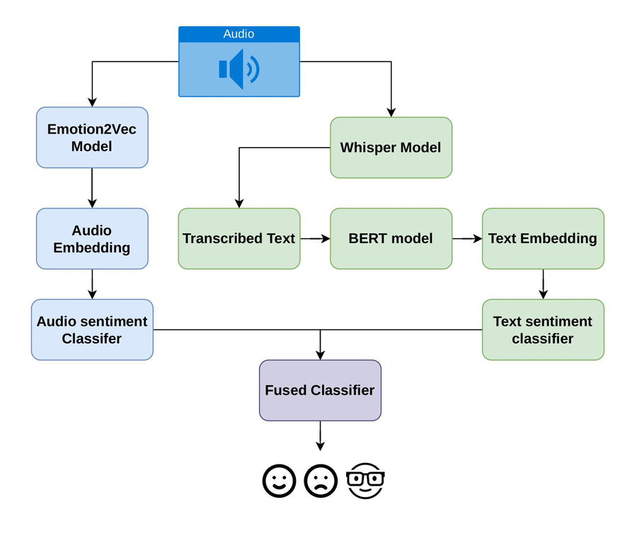

# Speech emotion recognition: audio + text fusion

Classifies a recording as **sad**, **happy** or **neutral** using two independent views
of the same utterance, combined by a confidence gate:



The audio classifier answers whenever its top probability clears a threshold; otherwise
the text classifier answers.

## Dataset

Two sets of recordings, each isolating one cue:

| folder | recordings | wording | emotion carried by |
|---|---|---|---|
| `data/neutral_text/` | 75 (25 sentences x 3 emotions) | neutral ("It is almost noon.") | voice only |
| `data/emotional_text/` | 15 (ids 21-25 x 3 emotions) | emotion-bearing ("I lost my job this morning.") | voice and words |

`data/emotional_text/sentences.csv` holds all 75 emotion-bearing sentences; only ids 21-25
have been recorded so far.

**Split.** Sentences 1-20 train, 21-25 test. The audio classifier trains on 60 neutral-wording
recordings, the text classifier on 60 emotion-bearing sentences, and both are tested on the
same 30 held-out utterances (15 from each set). No sentence appears in both halves.

## Setup

```bash
pip install -r requirements.txt
```

Models download on first use (emotion2vec, `whisper-base`, `bert-base-uncased`).

## 1. Extract embeddings

```bash
python extract_emo_embeddings.py --data-dir data/neutral_text
python extract_emo_embeddings.py --data-dir data/emotional_text
python extract_text_embedding.py --sentences data/emotional_text/sentences.csv
python extract_text_embedding.py --sentences data/neutral_text/sentences.txt
```

Writes 768-dim vectors to `embeddings/{audio,text}/<dataset>/` as `X.npy`, `y.npy`, `groups.npy`.
Audio uses emotion2vec utterance embeddings; text uses mean-pooled BERT token vectors.

## 2. Train and evaluate

```bash
python train_fusion.py --calibrate          # add --verbose for the sweep and per-sample table
```

Trains both classifiers, fuses them, and saves to `models/`. Both `C` values and the gate
threshold are chosen by 5-fold cross-validation **on the training data only** - nothing is
tuned on the test set. `--calibrate` Platt-scales the probabilities so the gate compares
honest confidences.

Baseline for comparison:

```bash
python evaluate_pretrained_emotion2vec.py   # emotion2vec's own head, same 30 test rows
```

## 3. Run the demo

```bash
python demo.py                              # web UI at http://127.0.0.1:7860
python demo.py data/emotional_text/sad/sad_21.wav
```

Upload a file or record from the microphone. The page shows Whisper's transcription, both
branches' probability distributions, and which one the gate trusted. Settings come from
`models/fusion.json`, so the demo always runs the configuration that was trained.


